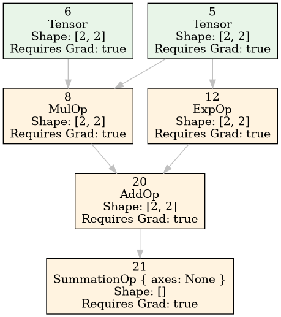
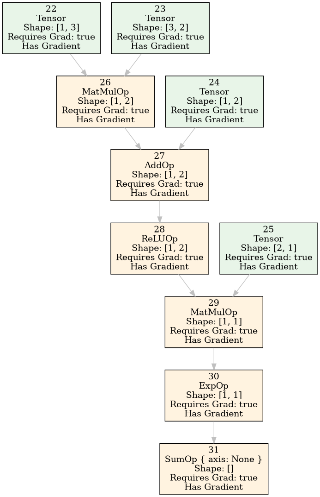

# Ferrox

**Ferrox** is a lightweight, CPU-based automatic differentiation engine written in **Rust**, inspired by [PyTorch's autograd](https://pytorch.org/docs/stable/autograd.html) and the [CMU Deep Learning Systems course](https://dlsyscourse.org/). It supports **reverse-mode automatic differentiation (backpropagation)** and uses [`ndarray`](https://crates.io/crates/ndarray) as its tensor computation backend.

---

## Features

- Reverse-mode automatic differentiation
- Dynamic computation graph construction
- Scalar and tensor support via `ndarray`
- Operator overloading for intuitive expressions
- Gradient accumulation
- Graph visualization (requires GraphViz installed).
- Written 100% in safe Rust


---

## Prerequisites.

First, ensure you have Rust and Cargo installed on your system.
You can install them using rustup:

```bash
curl --proto '=https' --tlsv1.2 -sSf https://sh.rustup.rs | sh
```
To run the project:

```bash
cargo run
```
To run unit tests:

```bash
cargo test
```

For visualizations, you will need Graphviz.

**Install Graphviz with**:

On Ubuntu/Debian:

```bash
sudo apt-get install graphviz
```

On macOS (using Homebrew):

```shell
brew install graphviz
```
On Windows (using Chocolatey):

```shell
choco install graphviz
```
You can verify the installation with:

```bash
dot -V
```

## Example usage:

```rust

fn main() -> Result<(), Box<dyn std::error::Error>> {
    // Example usage of the automatic differentiation engine
    let mut graph = Engine::new();

    // Create input tensors using the new Tensor wrapper
    let x_data = Tensor::from_vec(vec![1.0, 2.0, 3.0, 4.0, 5.0, 6.0], &[2, 3])?;
    let w_data = Tensor::from_vec(vec![0.5, 0.2, -0.1, 0.3, -0.4, 0.6], &[3, 2])?;

    let x = graph.create_tensor(x_data, true);
    let w = graph.create_tensor(w_data, true);

    println!("Created tensors:");
    println!("X shape: {:?}", graph.get_data(x).shape());
    println!("W shape: {:?}", graph.get_data(w).shape());

    // Forward pass: y = ReLU(x @ w)
    let matmul_result = graph.matmul(x, w)?;
    let y = graph.relu(matmul_result)?;

    // Sum to get scalar loss
    let loss = graph.sum(y, None)?;

    println!("\nForward pass completed");
    println!("Loss shape: {:?}", graph.get_data(loss).shape());
    println!(
        "Loss value: {:?}",
        graph.get_data(loss).data().iter().next().unwrap()
    );

    // === GRAPH VISUALIZATION: Initial Forward Pass ===
    println!("\n=== GRAPH VISUALIZATION: Forward Pass ===");
    println!("Neural Network: X @ W -> ReLU -> Sum (Loss)");
    graph.plot_graph(&[loss]);

    // Save the forward pass graph
    graph.save_graph_dot(&[loss], "imgs/forward_pass.dot")?;
    println!("Saved forward pass graph as: forward_pass.dot");

    // Backward pass
    graph.backward(loss)?;

    println!("\n=== BACKWARD PASS COMPLETED ===");

    if let Some(x_grad) = graph.get_gradient(x) {
        println!("Gradient w.r.t. x shape: {:?}", x_grad.shape());
        println!("Gradient w.r.t. x: {:?}", x_grad.data());
    }

    if let Some(w_grad) = graph.get_gradient(w) {
        println!("Gradient w.r.t. w shape: {:?}", w_grad.shape());
        println!("Gradient w.r.t. w: {:?}", w_grad.data());
    }

    // === GRAPH VISUALIZATION: After Gradients ===
    println!("\n=== GRAPH VISUALIZATION: After Backward Pass (with Gradients) ===");
    let grad_config = VisualizationConfig {
        show_gradients: true,
        show_shapes: true,
        show_values: false,
        ..Default::default()
    };
    let grad_visualizer = GraphVisualizer::with_config(grad_config);
    grad_visualizer.print_graph(&graph, &[loss]);

    // Save the graph with gradients
    grad_visualizer.save_dot(&graph, &[loss], "imgs/backward_pass_with_gradients.dot")?;
    println!("Saved backward pass graph as: backward_pass_with_gradients.dot");

    // Demonstrate additional operations
    println!("\n=== ADDITIONAL OPERATIONS DEMO ===");

    // Create some test tensors
    let a = graph.tensor_from_vec(vec![1.0, 2.0, 3.0, 4.0], &[2, 2], true)?;
    let b = graph.tensor_from_vec(vec![2.0, 1.0, 0.5, 2.0], &[2, 2], true)?;

    // Test element-wise operations
    let add_result = graph.add(a, b)?;
    let mul_result = graph.mul(a, b)?;
    let div_result = graph.div(a, b)?;

    println!("Element-wise operations:");
    println!("A + B: {:?}", graph.get_data(add_result).data());
    println!("A * B: {:?}", graph.get_data(mul_result).data());
    println!("A / B: {:?}", graph.get_data(div_result).data());

    // === GRAPH VISUALIZATION: Element-wise Operations ===
    println!("\n=== GRAPH VISUALIZATION: Element-wise Operations ===");
    graph.plot_graph(&[add_result, mul_result, div_result]);

    // Test scalar operations
    let scalar_add = graph.add_scalar(a, 10.0)?;
    let scalar_mul = graph.mul_scalar(a, 2.0)?;

    println!("\nScalar operations:");
    println!("A + 10: {:?}", graph.get_data(scalar_add).data());
    println!("A * 2: {:?}", graph.get_data(scalar_mul).data());

    // Test activations
    let exp_result = graph.exp(a)?;
    let log_result = graph.log(add_result)?; // log of positive values
    let neg_result = graph.negate(a)?;

    println!("\nActivations:");
    println!("exp(A): {:?}", graph.get_data(exp_result).data());
    println!("log(A+B): {:?}", graph.get_data(log_result).data());
    println!("-A: {:?}", graph.get_data(neg_result).data());

    // === GRAPH VISUALIZATION: Activation Functions ===
    println!("\n=== GRAPH VISUALIZATION: Activation Functions ===");
    graph.plot_graph(&[exp_result, log_result, neg_result]);

    // Test reshape and transpose
    let reshaped = graph.reshape(a, vec![4, 1])?;
    let transposed = graph.transpose(a, None)?;

    println!("\nShape operations:");
    println!("Original A shape: {:?}", graph.get_shape(a));
    println!("Reshaped A shape: {:?}", graph.get_shape(reshaped));
    println!("Transposed A shape: {:?}", graph.get_shape(transposed));

    // === GRAPH VISUALIZATION: Shape Operations ===
    println!("\n=== GRAPH VISUALIZATION: Shape Operations ===");
    let shape_config = VisualizationConfig {
        show_shapes: true,
        show_values: true,
        max_tensor_display: 8,
        ..Default::default()
    };
    let shape_visualizer = GraphVisualizer::with_config(shape_config);
    shape_visualizer.print_graph(&graph, &[reshaped, transposed]);

    // Test summation with axes
    let sum_all = graph.summation(a, None)?;
    let sum_axis0 = graph.summation(a, Some(vec![0]))?;
    let sum_axis1 = graph.summation(a, Some(vec![1]))?;

    println!("\nSummation operations:");
    println!("Sum all: {:?}", graph.get_data(sum_all).data());
    println!("Sum axis 0: {:?}", graph.get_data(sum_axis0).data());
    println!("Sum axis 1: {:?}", graph.get_data(sum_axis1).data());

    // === GRAPH VISUALIZATION: Reduction Operations ===
    println!("\n=== GRAPH VISUALIZATION: Reduction Operations ===");
    graph.plot_graph(&[sum_all, sum_axis0, sum_axis1]);

    // Test backward pass on complex computation
    let complex_result = graph.add(mul_result, exp_result)?;
    let final_loss = graph.summation(complex_result, None)?;

    // === GRAPH VISUALIZATION: Complex Computation Before Gradients ===
    println!("\n=== GRAPH VISUALIZATION: Complex Computation (Before Gradients) ===");
    println!("Complex computation: (A * B) + exp(A) -> Sum");
    graph.plot_graph(&[final_loss]);

    // Save complex computation graph
    graph.save_graph_dot(&[final_loss], "imgs/complex_computation.dot")?;
    println!("Saved complex computation graph as: complex_computation.dot");

    // Compute gradients for complex computation
    graph.backward(final_loss)?;

    println!("\nComplex computation gradients:");
    if let Some(a_grad) = graph.get_gradient(a) {
        println!("Gradient w.r.t. A: {:?}", a_grad.data());
    }
    if let Some(b_grad) = graph.get_gradient(b) {
        println!("Gradient w.r.t. B: {:?}", b_grad.data());
    }

    // === GRAPH VISUALIZATION: Complex Computation With Gradients ===
    println!("\n=== GRAPH VISUALIZATION: Complex Computation (With Gradients) ===");
    let complex_grad_config = VisualizationConfig {
        show_gradients: true,
        show_shapes: true,
        show_values: false,
        node_color: "#FFE6E6".to_string(),
        op_color: "#E6F3FF".to_string(),
        gradient_color: "#E6FFE6".to_string(),
        ..Default::default()
    };
    let complex_visualizer = GraphVisualizer::with_config(complex_grad_config);
    complex_visualizer.print_graph(&graph, &[final_loss]);

    // Save final computation with gradients
    complex_visualizer.save_dot(&graph, &[final_loss], "imgs/complex_with_gradients.dot")?;
    println!(" Saved complex computation with gradients as: complex_with_gradients.dot");

    // === DEMONSTRATION: Neural Network-like Computation ===
    println!("\n=== NEURAL NETWORK DEMONSTRATION ===");

    // Create a mini neural network
    let input = graph.tensor_from_vec(vec![1.0, 0.5, -0.2], &[1, 3], true)?;
    let weight1 = graph.tensor_from_vec(vec![0.1, 0.2, 0.3, -0.1, 0.4, -0.2], &[3, 2], true)?;
    let bias1 = graph.tensor_from_vec(vec![0.1, -0.05], &[1, 2], true)?;
    let weight2 = graph.tensor_from_vec(vec![0.5, -0.3], &[2, 1], true)?;

    // Layer 1: Linear + ReLU
    let linear1 = graph.matmul(input, weight1)?;
    let linear1_bias = graph.add(linear1, bias1)?;
    let activation1 = graph.relu(linear1_bias)?;

    // Layer 2: Linear + Exp (output)
    let linear2 = graph.matmul(activation1, weight2)?;
    let output = graph.exp(linear2)?;

    // Loss (sum of output)
    let nn_loss = graph.sum(output, None)?;

    println!("Neural Network Forward Pass:");
    println!("Input -> Linear(3,2) -> ReLU -> Linear(2,1) -> Exp -> Loss");
    println!("Final loss: {:?}", graph.get_data(nn_loss).data());

    // === GRAPH VISUALIZATION: Neural Network ===
    println!("\n=== GRAPH VISUALIZATION: Complete Neural Network ===");
    let nn_config = VisualizationConfig {
        show_shapes: true,
        show_gradients: false,
        show_values: false,
        node_color: "#F0F8FF".to_string(),
        op_color: "#FFF8DC".to_string(),
        gradient_color: "#F0FFF0".to_string(),
        ..Default::default()
    };
    let nn_visualizer = GraphVisualizer::with_config(nn_config);
    nn_visualizer.print_graph(&graph, &[nn_loss]);

    // Save neural network graph
    nn_visualizer.save_dot(&graph, &[nn_loss], "imgs/neural_network.dot")?;
    println!(" Saved neural network graph as: neural_network.dot");

    // Compute gradients for neural network
    graph.backward(nn_loss)?;

    println!("\nNeural Network Gradients:");
    if let Some(input_grad) = graph.get_gradient(input) {
        println!("Input gradient: {:?}", input_grad.data());
    }
    if let Some(w1_grad) = graph.get_gradient(weight1) {
        println!("Weight1 gradient shape: {:?}", w1_grad.shape());
    }
    if let Some(w2_grad) = graph.get_gradient(weight2) {
        println!("Weight2 gradient: {:?}", w2_grad.data());
    }

    // === GRAPH VISUALIZATION: Neural Network With Gradients ===
    println!("\n=== GRAPH VISUALIZATION: Neural Network (With Gradients) ===");
    let nn_grad_config = VisualizationConfig {
        show_gradients: true,
        show_shapes: true,
        show_values: false,
        ..Default::default()
    };
    let nn_grad_visualizer = GraphVisualizer::with_config(nn_grad_config);
    nn_grad_visualizer.print_graph(&graph, &[nn_loss]);

    // Save neural network with gradients
    nn_grad_visualizer.save_dot(&graph, &[nn_loss], "imgs/neural_network_with_gradients.dot")?;
    println!(" Saved neural network with gradients as: neural_network_with_gradients.dot");

    // === SUBGRAPH VISUALIZATION EXAMPLES ===
    println!("\n=== SUBGRAPH VISUALIZATION EXAMPLES ===");

    println!("\n--- First Layer Only ---");
    graph.plot_graph(&[activation1]);

    println!("\n--- Just Matrix Operations ---");
    graph.plot_graph(&[linear1, linear2]);

    println!("\n--- Multiple Outputs ---");
    graph.plot_graph(&[activation1, output, nn_loss]);

    // === ATTEMPT IMAGE GENERATION ===
    println!("\n=== IMAGE GENERATION ATTEMPTS ===");
    
    // Try to generate PNG images (requires Graphviz)
    match graph.save_graph_image(&[nn_loss], "imgs/neural_network.png") {
        Ok(_) => println!("Successfully saved neural_network.png"),
        Err(e) => println!("Could not save PNG (install Graphviz): {}", e),
    }

    match nn_grad_visualizer.save_image(&graph, &[final_loss], "imgs/complex_computation.png", "png") {
        Ok(_) => println!("Successfully saved complex_computation.png"),
        Err(e) => println!("Could not save PNG (install Graphviz): {}", e),
    }

    // === SUMMARY ===
    println!("\n=== VISUALIZATION SUMMARY ===");
    println!("Generated DOT files:");
    println!("  • forward_pass.dot");
    println!("  • backward_pass_with_gradients.dot");
    println!("  • complex_computation.dot");
    println!("  • complex_with_gradients.dot");
    println!("  • neural_network.dot");
    println!("  • neural_network_with_gradients.dot");
    println!("\n View DOT files online at: http://magjac.com/graphviz-visual-editor/");
    println!("Or install Graphviz locally to generate images automatically");

    // === INSTALLATION INSTRUCTIONS ===
    println!("\n=== GRAPHVIZ INSTALLATION ===");
    println!("To generate PNG/SVG images automatically:");
    println!("  • Ubuntu/Debian: sudo apt-get install graphviz");
    println!("  • macOS: brew install graphviz");
    println!("  • Windows: Download from https://graphviz.org/download/");
    println!("  • Then re-run this program to see image generation!");

    Ok(())
}

```

### Examples of graph visualizations:



